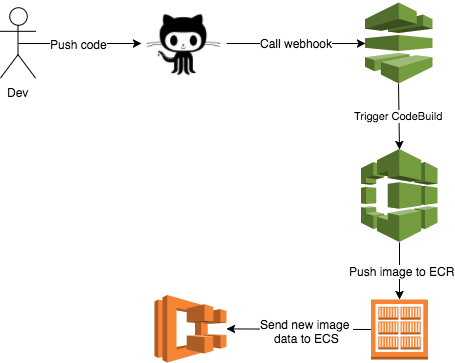

# README
This project is setup to be a demo application for an ECS cluster running in Fargate mode.
The only thing special in this source code repo is the ```buildspec.yml``` file.



## How is works
Code is committed to this repository. CodePipeline pick up the change and triggers a build using CodeBuild. CodeBuild pushes the image to ECR. An ECR cluster will automatically deploy the new image when it's pushed. 


## Things to note...


### ..when setting up CodeBuild
* Make sure you tick on ``Privileged``in the ``Environment: How to build``. As the documentation says: 
_Enable this flag if you want to build Docker images or want your builds to get elevated privileges._  
* Make sure you have the IAM permissions in place to interact with ECR for the CodeBuild service role. It will need:
    * ecr:GetAuthorizationToken
    * ecr:InitiateLayerUpload
    * ecr:UploadLayerPart
    * ecr:CompleteLayerUpload
    * ecr:BatchCheckLayerAvailability
    * ecr:PutImage
 
 ### ..when setting up ECS
 * When configuring the service, make sure you under ``Configure network`` select ``ENABLED`` under ``Auto-assign public IP``. If you don't do this your ECS can't pull your image from ECR. Another way is to use a NAT Gateway.